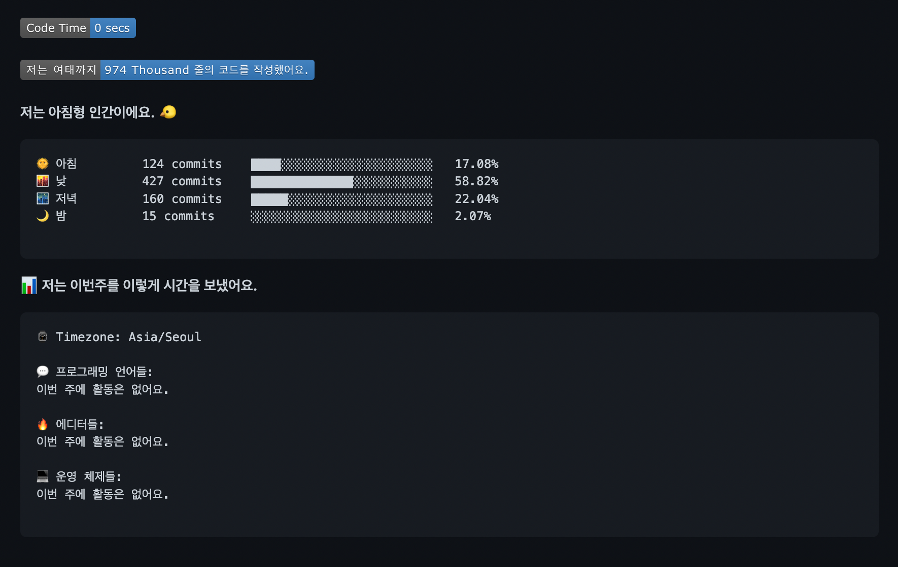

### Github waka-readme-stats 사용법
- 공식문서: [repository](https://github.com/anmol098/waka-readme-stats)

해당 저장소의 README를 그대로 따라하면 된다. 당연히 wakaTime이 본인이 사용하는 IDE에 추가되어야 한다.

1. 본인 프로필의 저장소의 README.md에 두 줄을 추가한다. START와 END 사이에 stats가 그려지게 된다.

```typescript
  <!--START_SECTION:waka-->
  <!--END_SECTION:waka-->
```

2. 깃허브세어의 활동을 추적할 수 있도록 github access token을 발급받아 복사해둔다.

> 발급 경로 : Github - Settings - Developer settings - Personal access tokens - Generate new token <br> 체크 항목 : repo, user

3. wataTime의 data를 받아올 수 있도록 API_KEY를 복사해둔다.
> 발급 경로 : https://wakatime.com/settings/account

4. 저장소 - Settings - Secrets에서 New repository secret를 눌러 다음 키 2개를 추가한다.

```typescript
  Name : GH_TOKEN
  Value : 복사해둔 github access token

  Name : WAKATIME_API_KEY
  Value : 복사해둔 wakatime api key
```

5. 저장소의 Actions 탭 - New - set up a workflow yourself을 누르고 다음 md를 복붙하여 저장한다.

```typescript
name: Waka Readme

on:
  schedule:
    # Runs at 12am IST
    - cron: '30 18 * * *'
  workflow_dispatch:
jobs:
  update-readme:
    name: Update Readme with Metrics
    runs-on: ubuntu-latest
    steps:
      - uses: anmol098/waka-readme-stats@master
        with:
          WAKATIME_API_KEY: ${{ secrets.WAKATIME_API_KEY }}
          GH_TOKEN: ${{ secrets.GH_TOKEN }}
          LOCALE: "ko"
          SHOW_LINES_OF_CODE: "True"
          SHOW_PROFILE_VIEWS: "False"
          SHOW_DAYS_OF_WEEK: "False"
          SHOW_SHORT_INFO: "False"
          SHOW_LOC_CHART: "False"
          SHOW_PROJECTS: "False"
          SHOW_LANGUAGE_PER_REPO: "False"
          
```

<br>




6. Actions 탭의 Select workflow - Waka Readme 클릭 - Run workflow 클릭하면 2분 정도 후에 업데이트가 된다. 이후 매일 00.00 IST에 자동 업데이트된다.
```toc

```
