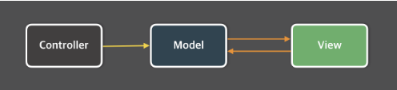
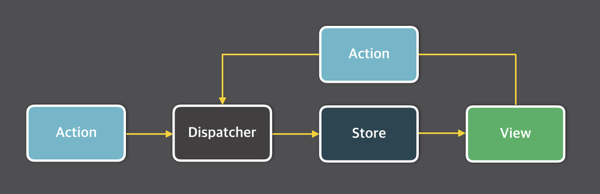

## MVC 아키텍쳐의 한계

Flux 아키텍쳐에 대해 알아보기 전에 MVC 아키텍쳐에 대해 간단한 얘기를 해보자.

Flux 아키텍쳐는 Facebook에서 개발한 단방향 데이터 흐름을 가지는 아키텍쳐 이다. MVC 아케텍쳐의 구조를 보면



이와 같은 구조를 가지는데 Controller는 Model의 데이터를 조회 하거나 업데이트하는 역할을 하고 Model은 이런 데이터를 View 통해 반영시키기도 하고. 또, View는 사용자로부터 데이터를 입력받기도 하기 때문에 사용자의 입력이 Model에 영향을 주기도 한다.

문제는 이러한 구조가 거대한 어플리케이션을 대상으로 한 프로젝트에 대해서는 너무 복잡하고 빨라진다는 것이다.


위 사진은 Facebook에서 얘기한 구조의 복잡성이다.

### 문제점

MVC의 근본적인 문제에 대해 설명하자면 사용자와의 상호작용이 View에서 일어났기 때문에 사용자의 입력에 따라 Model을 업데이트 해줘야 하는 경우가 있고 여기서 의존성의 이유로 하나의 모델만이 아닌 다른 모델 까지 업데이트 해야 할때도 있었을 것이다.

그 외에도 가끔 이러한 문제때문에 아주 많은 변경을 초래 하는 경우도 있었다.

(핑퐁 게임을 생각해 보자. 하나의 공을 주고 받는 것은 어렵지 않지만 아주 많은 공을 주고 받을때에는 공이 어디로 갈지 모르고 상당히 어려워 진다.)

### 해결 방법

Facebook 개발진들은 이에 대한 해결책으로 단방향 데이터 흐름을 택하였다. 단방향 데이터 흐름을 가지는 구조는 데이터는 단방향으로만 흐르고, 새로운 데이터를 넣으면 처음 부터 다시 시작되는 방식으로 설계 되어있다. 이러한 시스템 구성을 **FLUX** 구조라 부른다.

---

## Flux 구조?



Flux의 시스템 구조

Flux 구조의 가장 큰 특징은 단방향 데이터 흐름이다.

데이터의 흐름은 디스패쳐 => 스토어 => 뷰 순서 이며 뷰에서 입력이 발생하면 액션을 통해서 디스패쳐로 향하게 된다.

그렇다면 디스패쳐, 액션, 스토어, 뷰 하나하나 살펴 보도록 하자.

### Dispatcher

디스패쳐는 Flux 어플리케이션의 모든 데이터 흐름을 관리하는 일종의 허브 역할 이다. 액션이 발생하면 디스패처로 메세지나 액션 객체나 전달되고 디스패쳐에서는 이러한 메세지 혹은 액션 객체를 콜백 함수를 통해 스토어로 전달한다. 스토어에 접근하기 위한 일종의 단계이고 액션을 통해 스토어에 접근하기 위해서는 디스패쳐의 단계를 거쳐야 한다.

### Action

디스패쳐를 통해 스토어에 변화를 일으킬 수 있는데 이때 디스패쳐의 데이터 묶음을 액션이라고 한다. 예를 들어 GET_POST라는 게시글을 가져와서 스토어의 상태값을 변경해 주는 함수를 실행하고 싶을 때는 GET_POST라는 이름의 액션을 발생 시키는 것이다.

```
dispatch({ <= 디스패쳐
	type: GET_POST, <= 액션 이름
    // GET_POST을 통해 스토어에 변화가 일어남
})
```

여기에 payload 값을 넣어 데이터를 관리할 수 있다.

리덕스를 이용해 예를 들어보자!

### Store

스토어는 애플리케이션의 상태를 저장 한다. 스토어는 정부관료와 같다고도 표현을 한다 모든 상태 변경은 스토어에 의해 결정되며 상태 변경을 위한 요청을 스토어에 직접 할 수는 없다. 상태 변경을 위해서는 꼭 액션 생성자를 통해 디스패쳐 단계를 거친 후 액션을 보내야만 상태값 변경이 가능하다.

### View or View Contoller

뷰는 상태를 가져와서 보여주고 사용자로 부터 입력 받을 화면을 보여준다. 컨트롤러 뷰는 스토어와 뷰의 중간 관리자 같은 역할을 하고 스토어에서 상태 값 변경이 일어났을 때 스토어는 그 사실을 컨트롤러 뷰에서 전달하고 컨트롤러 뷰는 자신 아래에 모든 뷰에게 새로운 상태를 넘겨 준다.

```toc

```

<br>
<br>
