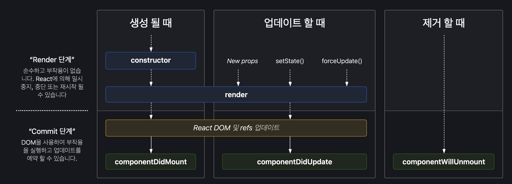

리액트는 MVC 패턴 중 View에 해당하는 라이브러리다. <br> 그러다 보니 각각의 컴포넌트는 컴포넌트의 수명주기, 라이프 사이클이 존재한다.
<br>
컴포넌트의 수명은 일반적으로 페이지에서 렌더링 되기 전 준비 과정에서 시작해 페이지에서 사라질 때 끝이난다.

아래의 이미지는 리액트 라이프 사이클을 나타낸다.


<br>

## 라이프 사이클의 유형

라이프 사이클은 크게 3가지 유형으로 나눌 수 있는데 생성이 될 때, 업데이트할 때, 제거할 때이다.<br>
리액트에서는 이러한 작업을 <b>Mount</b>, <b>Update</b>, <b>Unmount</b> 라고 한다.

Mount는 DOM이 생성되고 웹 브라우저 상에서 나타나는 것을 뜻한다.<br>
Update는 다음과 같은 4가지 상황에서 발생한다.

- prop가 바뀔 때
- state가 바귈 때
- 부모 컴포넌트가 리렌더링 될 때
- this.forceUpdate로 강제로 렌더링을 할 때

<b>Unmmount</b>는 DOM에서 제거되는 것을 뜻한다.

## React Lify Cycle

### constructor

컴포넌트가 처음 만들어질 때 실행되는 constructor(생성자)이다. 이 메소드에서 초기 state를 정할 수 있다.

class형 컴포넌트에선 초기 state를 정할 때 contructor를 사용해야 한다. <br>
react-hook에서는 useState hook를 사용하면 상태를 쉽게 설정해줄 수 있다.

```javascript
// Class Component
class LifeCycle extends Componenet {
  contructor(props) {
    super(props);
  }
}

// Hooks
function LifyCycle() {
  const [count, setCount] = useState(0);

  count = 변수
  setCount = 업데이트 해줄 함수
  useState() = 초기값
}
```

<br>

### render

가장 기본이면서 가장 중요한 메소드인 render이다. 컴포넌트를 렌더링할 때 필요한 메소드로 유일한 필수 메소드이기도 하다.
함수형 컴포넌트에선 render를 쓰지 않고 컴포넌트를 렌더링할 수 있다. <br>
컴포넌트의 props, state를 변경하지 않아야 하며, 호출될 때마다 같은 결과를 반환해야 한다는 특징을 가지고 있다.

```javascript
// Class
class LifeCycle extends Component {
  render() {
    return <h1>렌더링</h1>;
  }
}

// Hooks
const LifeCycle = () => {
  return <h1>렌더링</h1>;
};
```

<br>

### ComponentDidMount

이 메소드는 컴포넌트를 만들고 첫 렌더링을 마친 후 실행한다. 함수형 컴포넌트에서는 useEffect를 통해 활용할 수 있다.

```javascript
// Class
class LifyCycle extends Component {
    componentDidMount() {
        ...
    }
}

// Hooks
const LifyCycle = () => {
    useEffect(() => {
        ...
    }, []);
}
```

<br>

### ComponentDidUpdate

리렌더링을 완료하고, 화면에 원하는 변화가 반영되고 난 뒤에 호출되는 메소드이다. 컴포넌트가 업데이트 되었을때, DOM을 조작할 때 활용할 수 있다.

```javascript
//Class
class LifyCycle extends Component {
    componenetDidUpdate(prevProps, prevState) {
        ...
    }
}

// Hooks
const LifyCycle = () => {
    useEffect(() => {
        ...
    });
}
```

<br>

### ComponentWillUnmount

컴포넌트를 DOM에서 제거할 때 실행한다. 컴포넌트가 화면에서 사라지는 것을 의미하며 ComponentDidMount에서 등록한 이벤트가 있다면 여기서 제거 해야한다.

```javascript
// Class
class LifyCycle extends Component {
    componentWullUnmount() {
        ...
    }
}

// Hooks
const LifyCycle = () => {
    useEffect(() => {
        return () => {
            ...
        }
    }, []);
}
```

```toc

```
