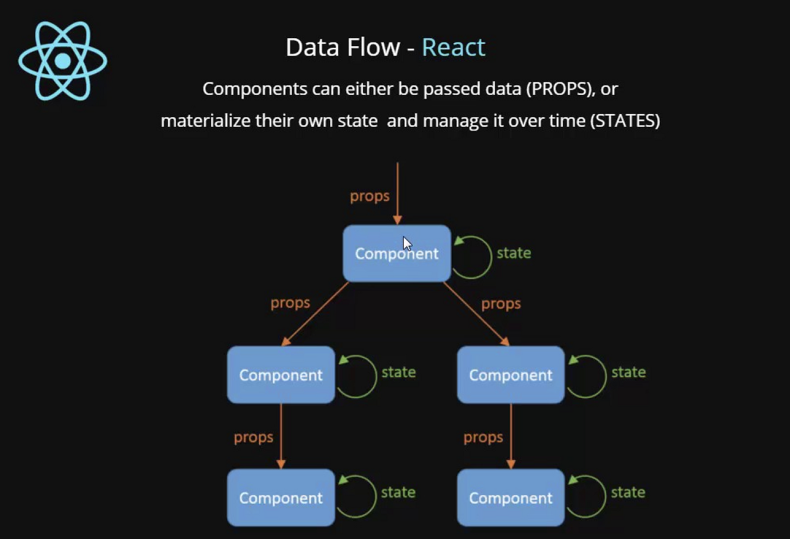

## Props 와 State 란?

Props와 State를 요약해서 설명하자면, <br>
`Props`는 부모 컴포넌트가 자식 컴포넌트에게 주는 데이터이고 해당 데이터는 직접적으로 수정할 수 없는 값.

`State`는 컴포넌트 내부에서 가지고 있는 값으로써 변경할 수 있는 값.

<br>

아래 그림은 props와 state를 잘 보여주는 그림이다.



props 와 state 로 간단한 예시를 해보자.

### Todo.js

```javascript
import React from 'react';
import Title from './Title';

class Todo extends Component {
  state = { count: 0 };

  onClick = () => {
    const { count } = this.state;
    this.setState({ count: count + 1 });
  };

  render() {
    const { count } = this.state;

    render(
      <>
        <Title title={`현재 카운트: $(count)`} />
        <button onClick={this.onClick}>증가</button>
      </>,
    );
  }
}
```

### Title.js

```javascript
import React from 'react';

function Title(props) {
  return (
    <>
      <p>{props.title}</p>
    </>
  );
}

export default Title;
```

<b>Todo</b> 컴포넌트와 <b>Title</b> 컴포넌트는 서로 부모 자식 관계이다. todo가 부모이고, title이 자식 관계 이다.

<br>

### ⛱️ Props

<b>Title</b>이라는 컴포넌트는 <b>Todo</b> 컴포넌트로부터 title 이라는 props를 받는다. <br>
이는 부모 컴포넌트로부터 일방향적으로 전달받은 것이고, Title Component 에서 수정할 수 없다.

### ⛱️ State

props 와 동일하게 렌더링 결과물에 영향을 주는 데이터를 갖고 있는 객체이지만 함수 내에 선언된 변수처럼 컴포넌트 안에서 관리하며, 값의 변경이 가능하다.

<br>

## 🙋🏻‍♂️ <b>중요한 부분</b>

### 1. react에서는 UI의 데이터는 반드시 props와 state로 관리되어야 한다.

이는 데이터를 일관성 있게 다루고자 하는 목적도 있지만 가장 중요한 이유는 React Lify Cycle이 props와 state의 변경을 기준으로 화면을 갱신하기 때문이다.

### 2. 컴포넌트는 자신이 갖고 있는 Props를 절대 수정하지 않는다.

Props 는 부모 컴포넌트가 자식 컴포넌트에게 주는 데이터이다. <br>
간단한 예제를 통해 알아보자.

```javascript
function num(sum1,sum2) {
    return sum1 + sum2;
```

다음 함수는 sum1 와 sum2 를 인자로 받아와서, sum1 와 sum2 의 합을 반환한다. 인자로 받아오는 sum1와 sum2의 값에 변화를 일으키지 않는다. 이러한 함수를 <b>순수 함수</b>라고 부르며, 같은 입력 값에 대해서 같은 출력 값을 반환한다. 모든 리액트 컴포넌트는 props의 측면에서 봤을 때, 순수함수처럼 동작해야한다.

```toc

```

<br>
<br>
